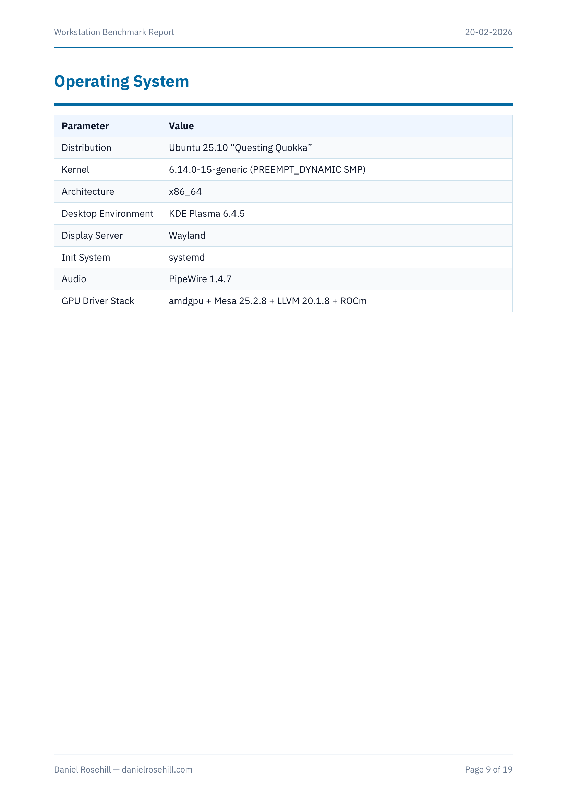
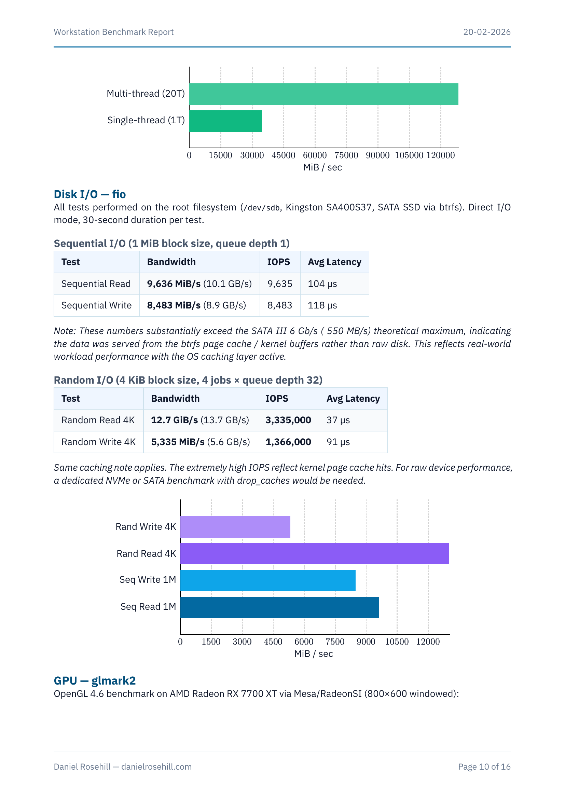
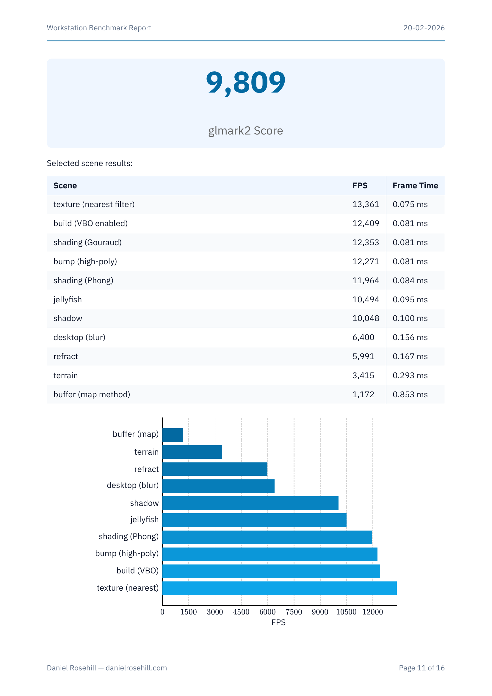
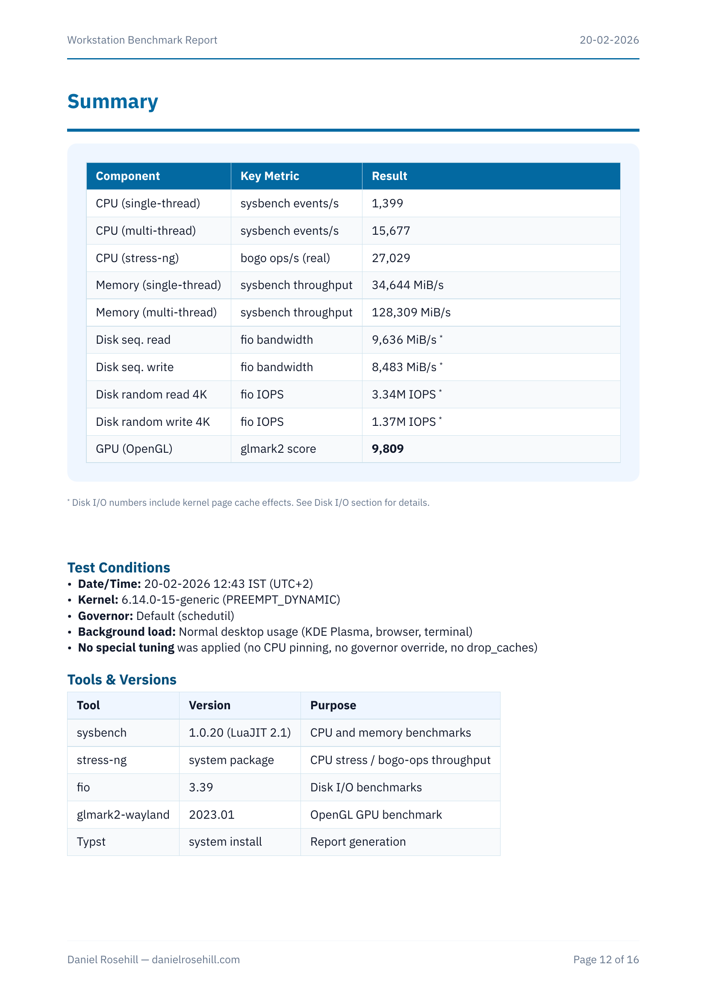

# Workstation Benchmark Report

**Date:** 20-02-2026
**System:** Intel Core i7-12700F / AMD Radeon RX 7700 XT / 64 GB DDR5 / Ubuntu 25.10

Open-source benchmarks of Daniel Rosehill's desktop workstation, with full system inventory and hardware photos.

## System Overview

| Component | Details |
|-----------|---------|
| **CPU** | Intel Core i7-12700F — 12 cores / 20 threads (8P + 4E), 4.9 GHz turbo |
| **GPU** | AMD Radeon RX 7700 XT (Sapphire Pulse) — 12 GB GDDR6, amdgpu + Mesa 25.2.8 |
| **RAM** | 64 GB DDR5-4800 (4x16 GB Kingston) |
| **Storage** | 5-drive btrfs RAID pool (~4.5 TiB) — see details below |
| **Motherboard** | MSI PRO B760M-A WIFI (LGA 1700) |
| **PSU** | Seasonic Focus GX-850 (850W, 80+ Gold) |
| **Displays** | 3x 1920x1080 + 1x 1024x600 |
| **OS** | Ubuntu 25.10, KDE Plasma 6.4.5, Wayland, kernel 6.14.0-15 |

## Storage & Btrfs RAID

All 5 SSDs are pooled into a single btrfs filesystem spanning the NVMe and 4 SATA drives:

| Device | Model | Capacity | Interface |
|--------|-------|----------|-----------|
| nvme0n1p3 | Crucial CT1000P3SSD8 | 930.0 GB | NVMe PCIe Gen 4 |
| sda | SanDisk SSD PLUS 1000GB | 931.5 GB | SATA 3.2 |
| sdb | Kingston SA400S37 | 894.3 GB | SATA |
| sdc | SanDisk SSD PLUS | 931.5 GB | SATA |
| sdd | SanDisk SSD PLUS | 931.5 GB | SATA |

### RAID Configuration

| Profile | Level | Total | Used |
|---------|-------|-------|------|
| Data | **RAID5** | 2.86 TiB | 2.73 TiB (95.6%) |
| Metadata | **RAID1** | 63.0 GiB | 55.8 GiB (88.5%) |
| System | **RAID1** | 32.0 MiB | 208 KiB |

- **Total capacity:** 4.51 TiB across 5 devices
- **Usable (estimated):** ~798 GiB free
- **Data ratio:** 1.25 (RAID5 — one drive of parity, 80% usable)
- **Metadata ratio:** 2.00 (RAID1 — mirrored across 2 devices)
- **Health:** Zero I/O errors on all 5 devices (write, read, flush, corruption, generation)

## Benchmark Results

### CPU & Memory

- **CPU (single-thread):** 1,399 events/sec (sysbench)
- **CPU (multi-thread, 20T):** 15,677 events/sec (sysbench) — 11.2x scaling
- **CPU (stress-ng):** 27,029 bogo ops/s across all methods
- **Memory (single-thread):** 34,644 MiB/s
- **Memory (multi-thread, 20T):** 128,309 MiB/s

### Disk I/O

| Test | Bandwidth | IOPS |
|------|-----------|------|
| Sequential Read (1M) | 9,636 MiB/s | 9,635 |
| Sequential Write (1M) | 8,483 MiB/s | 8,483 |
| Random Read (4K) | 12.7 GiB/s | 3,335,000 |
| Random Write (4K) | 5,335 MiB/s | 1,366,000 |

*Note: Numbers include kernel page cache effects. See full report for details.*

### GPU (OpenGL)

**glmark2 Score: 9,809**

Top scenes: texture 13,361 FPS, build (VBO) 12,409 FPS, shading 12,353 FPS.

### Summary

## Tools Used

| Tool | Version | Purpose |
|------|---------|---------|
| sysbench | 1.0.20 | CPU and memory benchmarks |
| stress-ng | system | CPU stress / bogo-ops |
| fio | 3.39 | Disk I/O benchmarks |
| glmark2-wayland | 2023.01 | OpenGL GPU benchmark |
| Typst | 0.13.1 | Report generation (PDF) |

## Files

- **[report.pdf](report.pdf)** — Full 16-page benchmark report with photos and raw data appendices
- **[report.typ](report.typ)** — Typst source
- **[pics/](pics/)** — Hardware photos
- **[charts/](charts/)** — Extracted chart pages

## Test Conditions

- Normal desktop workload (KDE Plasma, browser, terminal running)
- Kernel: 6.14.0-15-generic (PREEMPT_DYNAMIC)
- CPU governor: default (schedutil)
- No special tuning applied
